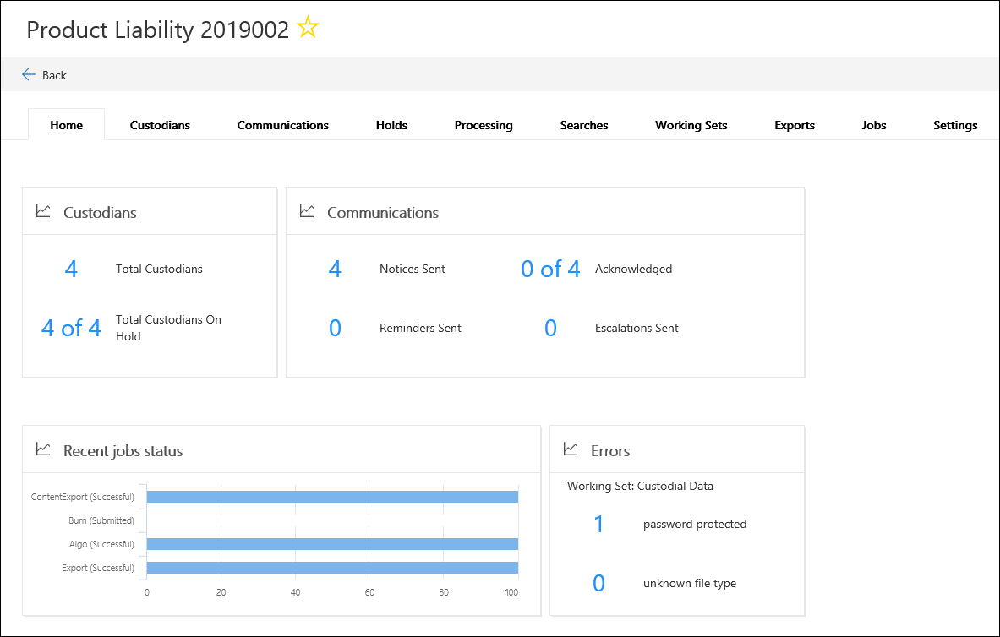

# Overview of Advanced eDiscovery (Preview) in Microsoft 365

Microsoft has just released a preview version of the updated Advanced eDiscovery tool that builds on the existing eDiscovery capabilities in Office 365. This preview version, called *Advanced eDiscovery (Preview)*, provides an end-to-end workflow to preserve, collect, review, analyze, and export content that's responsive to your organization's internal and external investigations. 

## Alignment with EDRM

The built-in workflow of Advanced eDiscovery (Preview) aligns with the eDiscovery process outlined by the Electronic Discovery Reference Model (EDRM). 

(Image source courtesy of edrm.net. The source image was made available under Creative Commons Attribution 3.0 Unported License.)

At a high level, here's how Advanced eDiscovery (Preview) supports the EDRM workflow:

- **Identification** - After you identify potential persons of interest in an investigation, you can add them as custodians (also called *data custodians*, because they may possess information that's relevant to the investigation) to a Advanced eDiscovery (Preview) case. After users are added as custodians, it's easy to preserve, collect, and review custodian documents.

- **Preservation** - To preserve and protect data that's relevant to an investigation, Advanced eDiscovery (Preview) lets you place a legal hold on the data sources associated with the custodians in a case. You can also place non-custodial data on hold. Additionally, Advanced eDiscovery (Preview) has a built-in communications workflow so you can send a legal hold notifications to custodians and track their acknowledgments.

- **Collection** - After you identified (and preserved) the data sources relevant to the investigation, you can use the built-in search tool in Advanced eDiscovery (Preview) search for and collect live data from the custodial data sources (and non-custodial data sources, if applicable) that may be relevant to the case.

- **Processing** - After you've collected all data relevant to the case, the next step is process it for further review and analysis. In Advanced eDiscovery (Preview), this means the in-place data that you identified in the collection phase is copied to an Azure storage location (called a *working set*), which provides you with a static view of the case data. 
 
- **Review** - After data has been added to a working set, you can view specific documents and run additional queries to reduce the data to what is most relevant to the case. Additionally, you can annotate and tag specific documents.
 
- **Analysis** - Advanced eDiscovery (Preview) provides integrated analytics tools that helps you further cull data from the working set that you determine isn't relevant to the investigation. In addition to reducing the volume of relevant data, Advance eDiscovery (Preview) also helps you save legal review costs by letting you organize content to make the review process easier and more efficient.

- **Production** and **Presentation** - When you're ready, you can export documents from a working set for legal review. You can export documents in their native format or in an EDRM-specified format so they can be imported into third-party review applications.

## Advanced eDiscovery (Preview) workflow

The following sections describe each step in the built-in workflow in Advanced eDiscovery (Preview). The following screenshot shows the **Home** tab of a case named *Product Liability 2019002*. Note the workflow tabs at the top of the page are sequenced to align with the EDRM process. 

For more information about the end-to-end workflow in Advanced eDiscovery (Preview), see this [Microsoft Mechanics video](https://go.microsoft.com/fwlink/?linkid=2066133). 

## Managing custodians

Use the **Custodians** tab to add and manage the people that you've identified as persons of interest in the case. When you add custodians, you can quickly perform custodian-related actions like placing a legal hold on custodian data sources, such as their mailbox and OneDrive account, communicating with custodians, and searching custodian data sources to collect content that's relevant to the case. As the case progresses, it's easy to add new custodians or release custodians from the case. For more information, see [Work with custodians in Advanced eDiscovery (Preview)](managing-custodians.md).

## Managing legal hold notifications

Use the **Communications** tab to manage the process of communicating with the custodians in the case. A legal hold notice instructs custodians to preserve any content that may be relevant to the case. Legal teams must be able to track that notices have been received, read, and acknowledged by custodians. The communications workflow in Advanced eDiscovery (Preview) allows you create and send initial notifications, reminders, release notices, and escalations if custodians fail to acknowledge a hold notification. For more information, see [Work with communications in Advanced eDiscovery (Preview)](managing-custodian-communications.md).

## Managing content preservation

When you add a custodian to a case, you have the option to place a hold on custodial data. Use the **Holds** tab to manage the hold created when you add custodians, and to manage additional legal holds associated with the case (for example, you can identify and place a hold on non-custodial data sources). You can also edit any hold in the case and make it a query-based hold so that only the content that matches the query is placed on hold. For example, you could add a date range to the hold so that only content created within a specific date ranged in preserved. You can also get statistics on content that's on hold, remove the hold after it's no longer relevant to the case, or delete it. For more information, see [Manage holds in Advanced eDiscovery (Preview)](managing-holds.md).

## Indexing custodian data

When you add a custodian and the corresponding custodial data sources to a case, any partially indexed item from a custodian data source is re-indexed (by a process called *Advanced indexing*). This allows custodial content such as images, unsupported file types, and other potentially un-indexed content to be fully searchable when you run searches to collect data for the case. Use the **Processing** tab to monitor the status of Advanced indexing and fix processing errors (using a process called *error remediation*.) For more information, see [Fix processing errors in Advanced eDiscovery (Preview)](processing-data-for-case.md).

## Collecting case data

Use the **Searches** tab to create searches to search the in-place custodial and non-custodial data sources in Office 365 for content relevant to the case. You can create and run query-based searches (using keywords and conditions) to identify a set of email messages and documents that are relevant to the case and that you want to further review and analyze in subsequent steps in the eDiscovery workflow. You can create one or more searches associated with the case. Additionally, you can use the search tool to preview sample documents and view search statistics that may help you refine and improve the search results. Once you're satisfied that the search results contain the all data relevant to the case, you add the search results to a working set for further review, analysis and if necessary, culling. For more information, see [Collect data for a case in Advanced eDiscovery (Preview)](collecting-data-for-ediscovery.md).

## Reviewing and analyzing case data

Use the **Working sets** tab to review and analyze the content that you've collected from the live system and added to a working set. A *working set* is a static collection of that data (in other words, an offline copy of data) of custodial data (and if applicable, non-custodial data ) that you collected in the previous phase of the eDiscovery workflow. When you add search results to a working set, a process is triggered that extracts files from containers, extracts metadata, and extracts text. When this process is complete, the system builds a new index of all the data that was collected from custodians and added to the working set. After the data is added to the working set, you can run additional queries to narrow the case data, view data as text or in the native file format, and annotate, redact, and tag documents in the working set. Additionally, you can perform advanced analytics such as identify document duplication, email threading, and themes. After you've culled the data to only what is relevant to the case, you can either download documents directly or export them along with file metadata, annotations, and any tags. For more information, see:

  - [Review case data in Advanced eDiscovery (Preview)](reviewing-data-in-working-set.md)
  - [Analyze data in a working set in Advanced eDiscovery (Preview)](analyzing-data-in-working-set.md)

## Exporting data for review and presentation

After you export the data from a working set, use the **Exports** tab to manage an export job and download data from a working set. When you export a working set, the data is uploaded to an Azure storage location and then is available to be downloaded to a local computer. You can obtain the location and storage assess key necessary to download the exported data on the **Exports** tab. For more information, see [Export case data in Advanced eDiscovery (Preview)](exporting-data-ediscover20.md).

## Managing jobs

Use the **Jobs** tab to monitor long-running processes for case-related tasks that you've initiated. Example of jobs include those related to re-indexing, searches, and exports. For example, you might create a new search on the **Searches** tab that includes a large number of data sources. The status of this search process is displayed on the **Jobs** tab. For more information, see [Manage jobs in Advanced eDiscovery (Preview)](managing-jobs-ediscovery20.md).

## Configuring case settings

Use the **Settings** tab to configure case-wide settings. This includes adding members to a case, closing or deleting a case, and configuring search and analytics behavior. For more information, see [Configure case settings in Advanced eDiscovery (Preview)](configuring-case-settings-ediscovery20.md).
