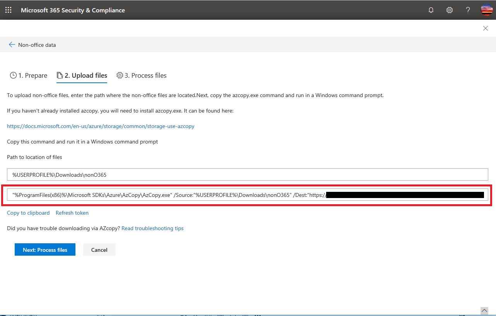

# Troubleshoot AzCopy in Advanced eDiscovery (Preview)

When loading non-Office 365 data or documents for error remediation in Advanced eDiscovery (Preview), the user interface supplies an Azure AzCopy command that contains parameters with the location of where the files that you want to upload are stored and the Azure storage location that the files will be uploaded to. To upload your documents, you copy this command and then run it in a Command Prompt on your local computer.  The follow screenshot shows an example of an AzCopy command:

In most cases, the command that's provided will work when you run it. However, there may be cases when the command that's displayed will not run successfully. Here's a few possible reasons.

## AzCopy isn't installed on the local computer or it's not installed in the default location

If AzCopy isn't installed or it's installed in a location other than the default install location (which is `%ProgramFiles(x86)%`), you may receive the following error when you run the AzCopy command:

    The system cannot find the path specified.

If AzCopy isn't install on the local computer, you can install from here (being sure to install it in the default location): [https://docs.microsoft.com/azure/storage/common/storage-use-azcopy](https://docs.microsoft.com/azure/storage/common/storage-use-azcopy).

If AzCopy is installed, but it's installed in a location different than the default location, you can copy the command, paste it to a text file, and then change the path to the location where AzCopy is actually installed. For example, if Azcopy is located in `%ProgramFiles%`, then you can change the first part of the command from `%ProgramFiles(x86)%\Microsoft SDKs\Azure\AzCopy.exe` to `%ProgramFiles%\Microsoft SDKs\Azure\AzCopy`. After you make this change, copy it from the text file and then run it a Command Prompt.

> [!TIP]
> If AzCopy is installed in a location other then the default install location, consider uninstalling it and then re-installing it in the default location. This will help prevent this issue in the future.