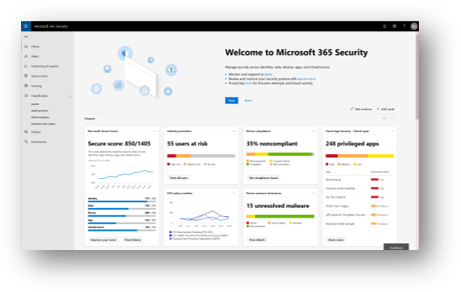
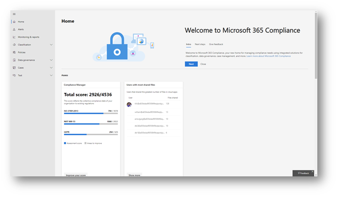

# Get ready for the new Microsoft 365 security center and Microsoft 365 compliance center

**We are pleased to announce the all-new [Microsoft 365 security center](#microsoft-365-security-center) and [Microsoft 365 compliance center](#microsoft-365-compliance-center), rolling out starting at the end of January 2019 and through March 2019**. Read this article to get an overview of what's coming, [what to expect](#what-to-expect), and [required licenses and permissions needed](#required-licenses-and-permissions).

## Microsoft 365 security center

Your new Microsoft 365 security center includes a dashboard to help you manage and monitor security across your identities, data, devices, apps, and infrastructure. You will also have easy access to your all-new Microsoft Secure Score, new device threat reports, new identity threat reports, and your Cloud App Security reports. 

When you use the Microsoft 365 security center for the first time, you'll see information across the top of the screen to help you get started. You'll also see how to navigate easily to the security features you're most interested in exploring.

Once the Microsoft 365 security center is enabled for your tenant, you will be able to access it at [https://security.microsoft.com](https://security.microsoft.com). 

> [!NOTE]
> You must be assigned a valid Azure Active Directory role to access the Microsoft 365 security center. To learn more, see the [Required licenses and permissions](#required-licenses-and-permissions) section (in this article).

## Microsoft 365 compliance center

Your new Microsoft 365 compliance center provides you with visibility into Microsoft Compliance Manager, which reflects your overall compliance posture and gives you recommended actions to help you configure settings to meet complex compliance obligations. You’ll have easy access to sensitivity and retention labels and policies, data loss prevention (DLP), data governance, eDiscovery, data subject requests (DSRs), case management, and Cloud App Security. Additionally, you can gain actionable insights and leverage intelligent automation to reduce your compliance risks and safeguard your digital estate. 

When you use the Microsoft 365 compliance center for the first time, you'll see information across the top of the screen to help you get started. You'll see how to navigate easily to the compliance features you're most interested in exploring.

Once the Microsoft 365 compliance center is enabled for your tenant, you will be to access it at [https://compliance.microsoft.com](https://compliance.microsoft.com).  

> [!NOTE]
> You must be assigned a valid Azure Active Directory role to access the Microsoft 365 compliance center. To learn more, see the [Required licenses and permissions](#required-licenses-and-permissions) section (in this article).

## What to expect

### Coming soon!

The new Microsoft 365 security center and the new Microsoft 365 compliance center are rolling out beginning late January and through March 2019. You should have access to the new Microsoft 365 security center and Microsoft 365 compliance center within this timeframe.

### Easy access!

With improved navigation, integrated solutions, and a streamlined experience, you'll be able to see and access the information you're most interested in and take advantage of the powerful security and compliance solutions in Microsoft 365.

### Smooth transition!

You can expect a smooth transition to the new centers. After this change is fully rolled out, we plan to retire the former Microsoft 365 Security & Compliance Center ([https://protection.microsoft.com](https://protection.microsoft.com)). The administrator experience will change, but this won’t impact your current security and compliance configurations.

After this update is rolled out, if your organization has Microsoft 365 Enterprise E3 or E5, your security and compliance administrators can:

- Navigate directly to [https://security.microsoft.com](https://security.microsoft.com) and [https://compliance.microsoft.com](https://compliance.microsoft.com);  or  
- Go to the Microsoft 365 admin center, and then navigate to the new Microsoft 365 security center and Microsoft 365 compliance center (links are under Admin Centers in the left navigation pane).

> [!TIP]
> If you are using the Office 365 Security & Compliance Center ([https://protection.office.com](http://protection.office.com)), you will still be able to configure and manage your Office 365 settings within your existing Office 365 Security & Compliance Center. Configurations will be maintained in the existing Office 365 Security & Compliance Center as well as in the new Microsoft 365 security center and Microsoft 365 compliance center.  

## Required licenses and permissions

### Licenses

To get the new Microsoft 365 security center and Microsoft 365 compliance center, your organization must have a subscription to Microsoft 365 E3 or E5, or a Volume Licensing equivalent (which consists of Office 365 Enterprise E3 or E5, Enterprise Mobility + Security E3 or E5, and Windows 10 Enterprise E3/E5). To learn more about these plans, see [Discover the Microsoft 365 Enterprise solution that’s right for you](https://www.microsoft.com/microsoft-365/compare-all-microsoft-365-plans).

### Roles and permissions

Users must be assigned the Global Administrator, Compliance Administrator, Security Administrator, or Security Reader role in Azure Active Directory to access the new Microsoft 365 security center or Microsoft 365 compliance center.

- Global Administrators can access both the security center and the compliance center

- Compliance Administrators can access the compliance center

- Security Administrators or Security Readers can access the security center

> [!NOTE]
> Additional roles, including Security Operator and Compliance Data Administrator, are coming soon.

The following table summarizes who can access various portals across Azure, Office 365, and Windows:

|Portal  |Global Administrator  |Security  Administrator or Security Reader |Compliance Administrator  |
|---------|---------|---------|---------|
|[Office 365 Security & Compliance Center](https://protection.office.com) |Yes |Yes  |Yes |
|[Microsoft 365 security center](https://security.microsoft.com) |Yes  | Yes  | No        |
|[Microsoft 365 compliance center](https://compliance.microsoft.com) | Yes | No | Yes |
|[Compliance Manager](https://aka.ms/compliancemanager) |Yes | Yes |Yes  |
|[Azure Information Protection](https://docs.microsoft.com/azure/information-protection) |Yes |Yes |No |
|[Azure Security Center](https://docs.microsoft.com/azure/security-center/)  |Yes |Yes |No |
|[Azure Advanced Threat Protection](https://docs.microsoft.com/azure-advanced-threat-protection/what-is-atp)  |Yes |Yes |No |
|[Windows Defender ATP](https://docs.microsoft.com/windows/security/threat-protection/windows-defender-atp/windows-defender-advanced-threat-protection?ocid=tia-260153000#windows-defender-atp) |Yes |Yes |No |
|[Identity Protection](https://docs.microsoft.com/azure/active-directory/identity-protection)     |Yes |Yes |No |
|[Privileged Identity Management](https://docs.microsoft.com/azure/active-directory/privileged-identity-management)     |Yes |Yes |No |
|[Intune](https://docs.microsoft.com/intune)     |Yes |Yes |Yes |
|[Cloud App Security](https://docs.microsoft.com/cloud-app-security/)     |Yes |Yes |Yes |
|[Secure Score](https://docs.microsoft.com/office365/securitycompliance/office-365-secure-score)     |Yes |Yes |No |
|[Exchange](https://docs.microsoft.com/exchange/)     |Yes |Yes |Yes |

## Additional resources

[Microsoft 365 roadmap](https://www.microsoft.com/microsoft-365/roadmap)

