# Monitor devices in Microsoft 365 security

[!include[Prerelease�information](prerelease.md)]

Keep your devices secure, up-to-date, and spot potential threats in the Microsoft 365 security center.

## View device alerts

Get up-to-date alerts about breach activity and other threats on your devices from Windows Defender ATP (available with an E5 license). Microsoft 365 security center has several cards that allow you to effectively monitor these alerts at a high-level, depending on your preferred workflow.

### Monitor high-impact alerts

Each Windows Defender ATP alert has a corresponding severity—high, medium, low, or informational—that indicates its potential impact to your network if left unattended.  

Use the **Device alert severity** card to focus specifically on alerts that are more severe and might require immediate response. From this card, you can view more information on the Windows Defender Security Center portal.

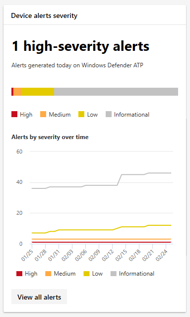

### Understand sources of alerts

Windows Defender ATP leverages data from a broad range of security sensors and intelligence sources to generate alerts. For example, it can use detection information from Windows Defender Antivirus and third-party antimalware, as well as your own custom threat intelligence provided through the web service API.

The **Device alert detection** sources card shows the distribution of alerts by source. This card can help you track activity related to certain sources, particularly your custom sources. You can also use this to focus on alerts coming from sensors that are not configured to automatically block malicious activity or components.

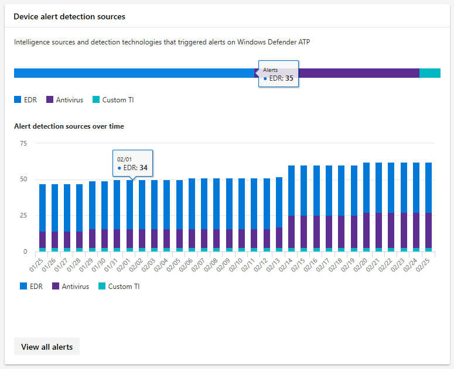

From this card, you can view more information on the Windows Defender Security Center portal.

### Understand the types of threats that trigger alerts

Windows Defender ATP sorts each alert into a category representing a certain stage in the attack chain or a type of threat component. For example, detected threat activity might be categorized into “lateral movement” to indicate that the activity involved an attempt to reach other devices on the network and has likely occurred after attackers have gained an initial foothold. When detected, a threat component might either be classified broadly as “malware” or more specifically as “ransomware”, “credential stealing” or other types of malicious or unwanted software.

The **Device threat categories** card shows the distribution of alerts into these categories. You can use this information to identify threat activity, such as attempts at credential theft, which can have more significant impact compared to attempts at social engineering, for example. You can also use this to monitor for potentially destructive threats like ransomware.

### Monitor active alerts

The **Device alert status** card indicates the number of alerts that have not been resolved and might require attention. From this card, you can view more information on the Windows Defender Security Center portal.

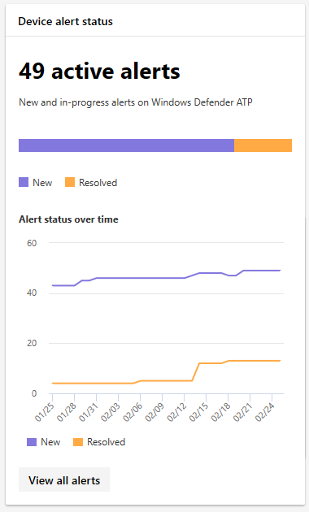

### Monitor classification of resolved alerts

When resolving a Window Defender ATP alert, your security staff can specify whether an alert has been verified as:

* A true alert that identifies actual breach activity or threat components
* A false alert that has incorrectly detected normal activity

The **Device alert classification** card shows whether your resolved alerts have been classified as true or false alerts. From this card, you can view more information on the Windows Defender Security Center portal.

Note: In some cases, classification information is unavailable for certain alerts.

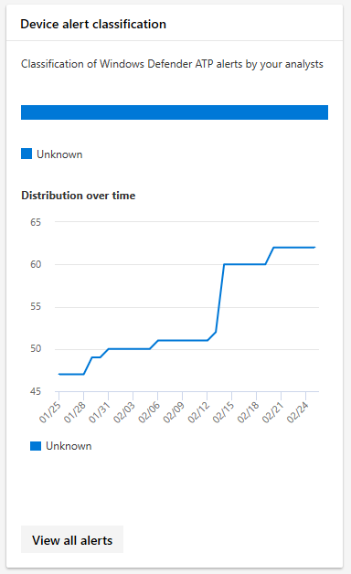

### Monitor determination of resolved alerts

In addition to classifying whether an alert is true or false during resolution, your security staff can provide a determination, indicating the type of normal or malicious activity that was found while validating the alert.

The **Device alert determination** card shows the determination provided for each alert, specifically:

* **APT** – advanced persistent threat, indicating that the detected activity or threat component is part of a sophisticated breach designed to gain a foothold in the affected network  
* **Malware** – malicious file or code
* **Security personnel** – normal activity performed by security staff
* **Security testing** – activity or components designed to simulate actual threats and expected to trigger security sensors and generate alerts
* **Unwanted software** – apps and other software that are not considered malicious, but otherwise violate policy or acceptable use standards
* **Others** – any other determination that does not fall under the provided types

From this card, you can view more information in Windows Defender security center.

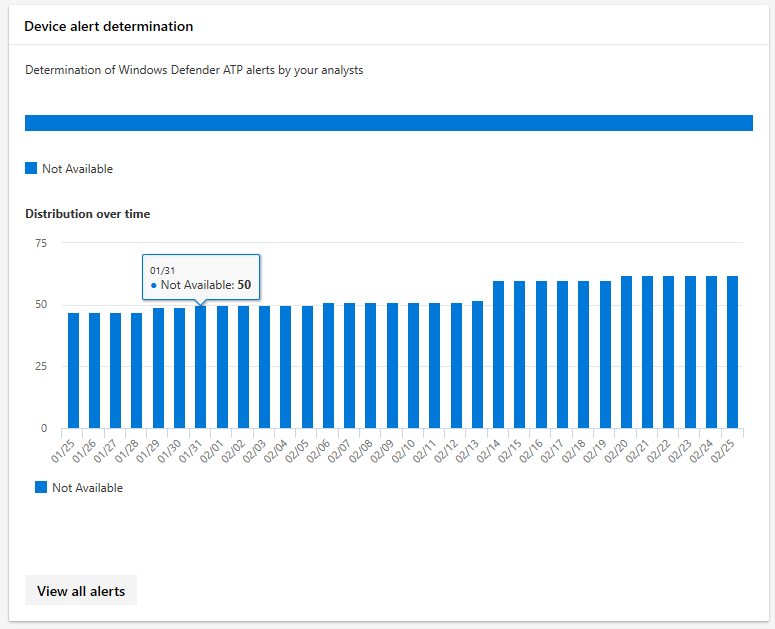

### Understand which devices are at risk

**Device protection** shows the risk level for devices. The risk level is based on factors such as the type and severity of alerts on the device.

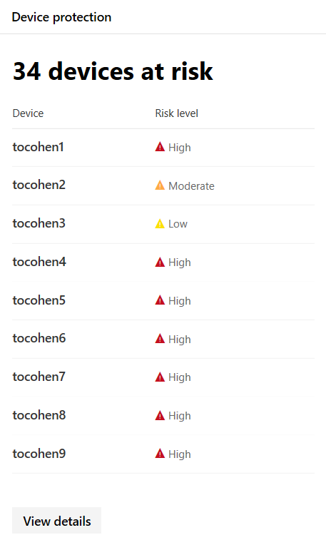

## Monitor and report status of Intune-managed devices

The following monitoring and reports contain data from devices enrolled in Intune. Data from unenrolled devices is not included. Only Global Administrators can view these cards.

Intune enrolled device data includes:

* Device compliance
* Devices with active malware
* Types of malware on devices
* Malware on devices
* Devices with malware detections
* Users with malware detections

### Monitor device compliance

**Device compliance** shows how many devices that are enrolled in Intune comply with configuration policies.

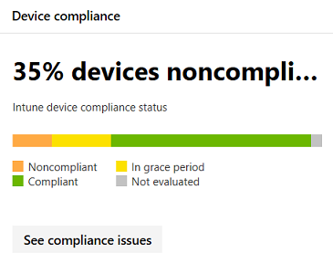

### Discover devices with malware detections

**Device malware detections** provides the number of Intune enrolled devices with malware that have not been fully resolved due to pending actions—a restart, a full scan or manual user actions—or if the remediation action did not complete successfully.

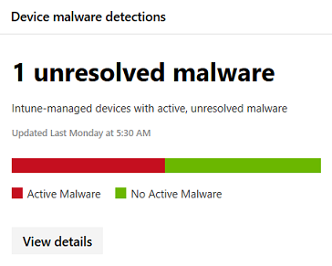

### Understand the types of malware detected

**Types of malware on devices** shows different kinds of malware that have been detected on devices enrolled in Intune. You can investigate each type in Microsoft 365 security center.

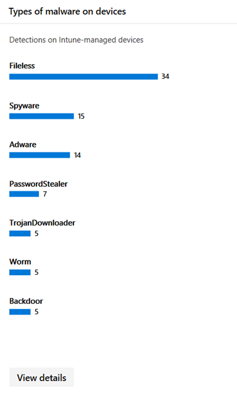

### Understand the specific malware detected on your devices

**Malware on devices** provides a list of the specific malware detected on your devices.

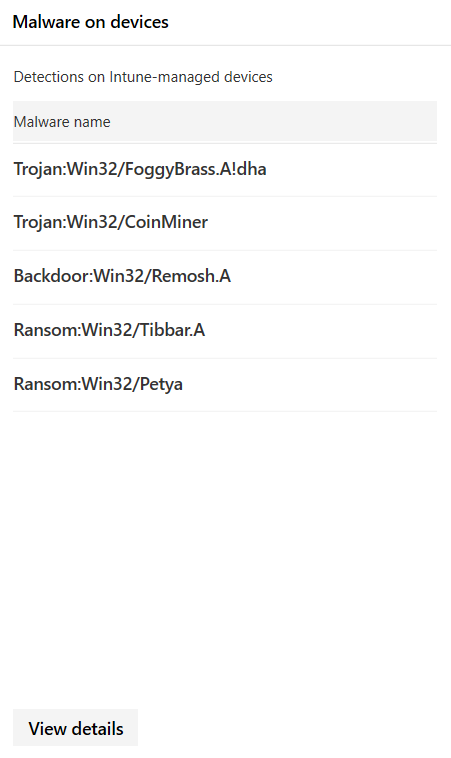

### Understand which devices have the most malware

**Devices with malware detections** shows which devices have the most malware detections. In Microsoft 365 security center, you can investigate whether malware is active, who uses the device, and its management status in Intune.

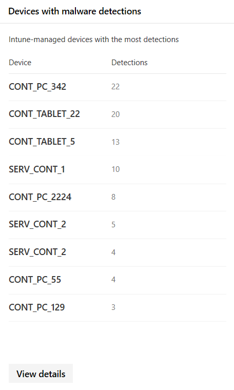

### Understand which users have devices with the most malware

**Users with malware detections** shows users with devices that had the most malware detections. In Microsoft 365 security center, you can see how many devices are assigned to each user and more information about each device and the type of malware.

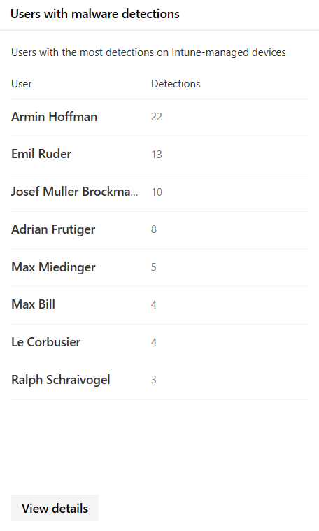

## Monitor and manage ASR rule deployment and detections

[Attack Surface Reduction (ASR) rules](https://docs.microsoft.com/en-us/windows/security/threat-protection/windows-defender-exploit-guard/attack-surface-reduction-exploit-guard) help prevent actions and apps that are typically used by exploit-seeking malware to infect machines. These rules control when and how executables can run. For example, you can prevent JavaScript or VBScript from launching a downloaded executable, block Win32 API calls from Office macros, or block processes that run from USB drives.

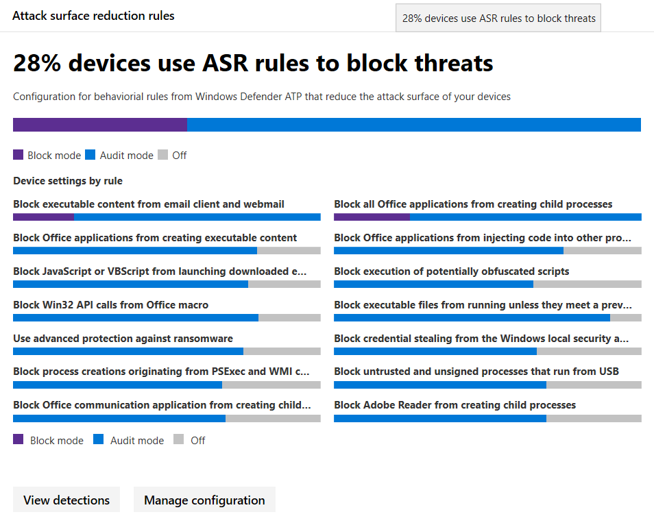

The **Attack surface reduction rules** card provides an overview of the deployment of rules across your devices.

The top bar on the card shows the total number of devices that are in the following deployment modes:

* **Block mode** – devices with at least one rule configured to block detected activity
* **Audit mode** – devices with no rules set to block detected activity, but has at least one rule set to audit detected activity  
* **Off** – devices with all ASR rules turned off

The lower part of this card shows settings by rule across your devices. Each bar indicates the number of devices that are set to block or audit detection or have the rule completely turned off.

### View ASR detections

To view detailed information about ASR rule detections in your network, select **View detections** on the **Attack surface reduction rules** card. The **Detections** tab in the detailed report page will open.

The chart at the top of the page shows detections over time stacking detections that were either blocked or audited. The table at the bottom lists the most recent detections. Use the following information on the table to understand the nature of the detections:

* **Detected file** – the file, typically a script or a document, whose contents triggered the suspected attack activity
* **Rule** – name describing the attack activities the rule is designed to catch. Read about existing ASR rules
* **Source app** – the application that loaded or executed content triggering the suspected attack activity. This could be a legitimate application, such as web browser, an Office application, or a system tool like PowerShell
* **Publisher** – the vendor that released the source app

### Review device ASR rule settings

In the **Attack surface reduction rules** report page, go to the **Configuration** tab to review rule settings for individual devices. Select a device to get detailed information about whether each rule is in block mode, audit mode, or turned off entirely.

Microsoft Intune provides management functionality for your ASR rules. If you want to update your settings, select **Get started** under **Configure devices** in the tab to open device management on Intune.

### Exclude files from ASR rules

By excluding files from detections, you can prevent unwanted false positive detections and more confidently deploy attack surface reduction rules in block mode.

While file exclusions for attack surface reduction rules are managed on Microsoft Intune, Microsoft 365 security center provides an analysis tool to help you understand the files that are triggering detections. It also helps collect the names of the files you might want to exclude.

To start analyzing detections and collecting files for exclusion, go to the **Add exclusions** tab in the **Attack surface reduction rules** report page.

The table lists all the file names detected by your attack surface reduction rules. Once you select a file or multiple files, you can review the impact of adding those files to your exceptions:

* The reduction in the total number of detections
* The reduction in the total number of devices affected by the detections

To get a list of the selected files with their full paths for exclusion, select **Get exclusion paths**.

For more information about exclusions and detailed instructions about how to add them, read [troubleshoot attack surface reduction rules](https://docs.microsoft.com/en-us/windows/security/threat-protection/windows-defender-exploit-guard/troubleshoot-asr).
