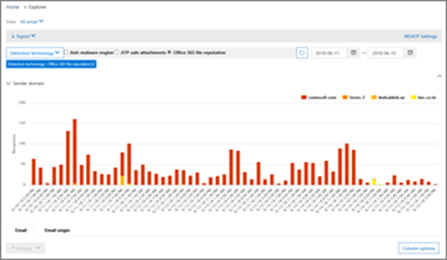

# Use Threat Explorer in the Security &amp; Compliance Center

If your organization has [Office 365 Advanced Threat Protection Plan 2](office-365-ti.md), and you have the necessary permissions, you can use Threat Explorer to identify and analyze threats. For example, you can identify and delete malicious email that was delivered, or see malware that was caught by Office 365 security features. Threat Explorer (also referred to as Explorer) is a powerful near real-time tool to help Security Operations teams investigate and respond to threats in the Security &amp; Compliance Center.
  

  
To use Explorer, in the Security &amp; Compliance Center, go to **Threat management** \> **Explorer**.

> [!IMPORTANT]
> Office 365 Threat Intelligence is now part of Office 365 Advanced Threat Protection Plan 2, with additional threat protection capabilities. To learn more, see [Office 365 Advanced Threat Protection plans and pricing](https://products.office.com/exchange/advance-threat-protection) and the [Office 365 Advanced Threat Protection Service Description](https://docs.microsoft.com/office365/servicedescriptions/office-365-advanced-threat-protection-service-description).
      
## Explorer overview

Explorer displays information about suspected malware and phish in email and files in Office 365, as well as other security threats and risks to your organization. When you first open Explorer, the default view shows email malware detections for the past 7 days. Explorer can also show security protection features in Office 365, including [Safe Links](atp-safe-links.md) and [Safe Attachments](atp-safe-attachments.md) and can be modified to show data for the past 30 days. If you have a trial subcription for Office 365 Advanced Threat Protection Plan 2 or Office 365 E5, you will only see detections and email data for the past 7 days.
  

  
Use the View menu to change what information is displayed.
  

  
Explorer has several filtering and querying capabilities that enable you to drill into details, such as top targeted users, top malware families, detection technology and more. Each kind of report offers a variety of ways to view and explore data.

> [!IMPORTANT]
> Do not use wildcard characters, such as an asterisk (*) or a question mark (?), with Explorer. When you search on the Subject field for email messages, Explorer will perform partial matching and yield results similar to a wildcard search.

## Email \> Malware

This view shows email messages identified as containing malware.  

View information in the chart by malware family, sender domain, sender IP, protection status (actions taken by your threat protection features and policies in Office 365), and detection technology (how the malware was detected).  

         

Below the chart, view details about top malware families, top targeted users, and more details about specific messages. 

## Email \> Phish

This view shows email messages identified as phishing attempts.  

View information by sender domain, sender IP, and protection status (actions taken by your threat protection features and policies in Office 365). 

 

Below the chart, view more details about specific messages. 

## Email \> User-reported

This view shows email that users have reported as junk, not junk, or phishing email.  

View information by report type (the user's determination that the email was junk, not junk, or phish), and by delivery reason (reasons why email went to a specific location, such as a spam filter policy, a mail flow rule, a blocked-senders list, a safe-senders list, etc.).  

  

Below the chart, view more details about specific email messages, such as subject line, the sender's IP address, the user that reported the message as junk, not junk, or phish, and more. 

## Email \> All mail

This views shows an all-up view of email activity, including email identified as malicious due to phishing or malware, as well all non-malicious mail (normal email, spam, and bulk mail). 

> [!NOTE]
> If you get an error that reads **Too much data to display**, add a filter and, if necessary, narrow the date range you're viewing. 

To apply a filter, choose **Sender**, select an item in the list, and then click the Refresh button. In our example, we used **Detection technology** as a filter (there are several options available). View information by sender, sender's domain, recipients, subject, attachment filename, malware family, protection status (actions taken by your threat protection features and policies in Office 365), detection technology (how the malware was detected), and more. 

 

Below the chart, view more details about specific email messages, such as subject line, recipient, sender, status, and so on. 

## Content \> Malware

This view shows files that were identified as malicious by Office 365 Advanced Threat Protection in SharePoint Online, OneDrive for Business, and Microsoft Teams.

View information by malware family, detection technology (how the malware was detected), and workload (OneDrive, SharePoint, or Teams). 

  

Below the chart, view more details about specific files, such as attachment filename, workload, file size, who last modified the file, and more. 
  
## (New!) Click-to-filter capabilities

New to Explorer is the ability to click to filter. When you click an item in the legend, that item becomes a filter for the report. For example, suppose we are looking at the Malware view in Explorer:
  

  
Clicking **ATP Detonation** in this chart results in a view like this: 
  

  
In this view, we are now looking at data for files that were detonated by [Office 365 ATP Safe Attachments](atp-safe-attachments.md). Below the chart, we can see details about specific email messages that had attachments that were detected by ATP Safe Attachments.
  

  
Selecting one or more items activates the **Actions** menu, which offers several choices from which to choose for the selected item(s). 
  

  
The ability to filter in a click and navigate to specific details can save you a lot of time in investigating threats.
  
## How do I get Explorer?

Explorer is included in [Office 365 Advanced Threat Protection Plan 2](office-365-ti.md). 

You must have appropriate permissions, such as those granted to a security administrator or security reader, in order to view and use Explorer. To learn more, see [Permissions in the Office 365 Security &amp; Compliance Center](permissions-in-the-security-and-compliance-center.md).
  
## Related topics

[Reports and insights in the Office 365 Security &amp; Compliance Center](reports-and-insights-in-security-and-compliance.md)
  
[Find and investigate malicious email that was delivered (Office 365 Threat Invesitgation and Response)](investigate-malicious-email-that-was-delivered.md)
  
[Anti-spam and anti-malware protection in Office 365](anti-spam-and-anti-malware-protection.md)
  

